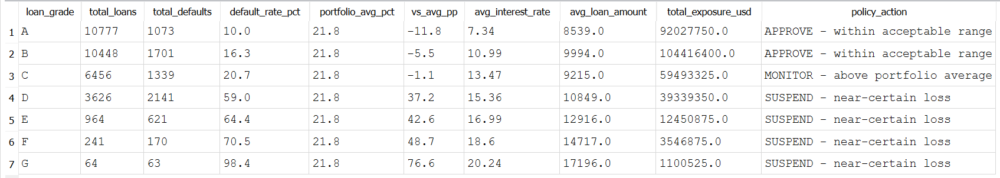
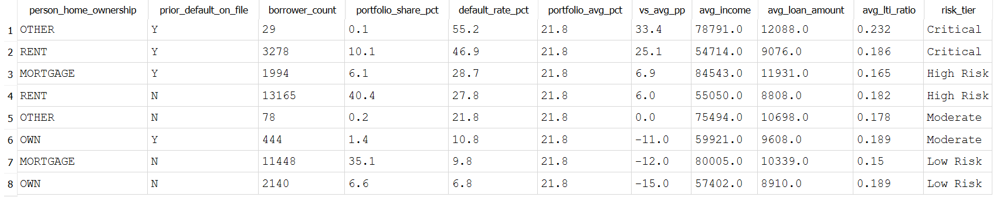
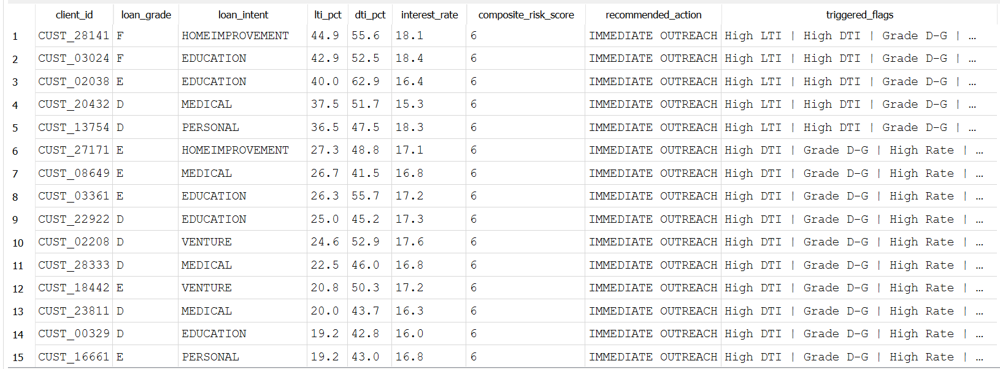

# 🏦 Nova Bank — Credit Risk Analysis

**Live dashboard:** [https://nguyennie.github.io/nova_bank_analytics/](https://nguyennie.github.io/nova_bank_analytics/)

---

## Why I built this

I wanted to understand how banks actually make lending decisions — not from theory, but from data.

This project simulates the role of a credit risk analyst at Nova Bank, a lender operating across the USA, UK, and Canada. The portfolio has a 21.8% default rate across 32,581 loans — roughly 1 in 5 loans defaults. The question I set out to answer: if I were the analyst on this team, what would I tell leadership, and what policies would I recommend changing?

---

## Key findings

- **Loan-to-income ratio is the strongest default predictor** (Pearson r = 0.386). Borrowers where loan repayment exceeds 35% of their monthly income default at dramatically higher rates.
- **Loan grade is the sharpest risk boundary** — Grade C defaults at 20.7%, Grade D at 59.0%. A single grade drop nearly triples default risk. Grades F and G approach 100%.
- **Prior default history doubles risk** — borrowers with a prior default on file default at 37.8% vs 18.4% for clean records (2.05× multiplier).
- **Housing stability matters** — renters default at 31.6%, homeowners at 7.5%. Combining housing status with prior default history reveals an 8× spread across segments.
- **Geography and gender have zero predictive power** — USA, UK, and Canada all show ~21.8% default rates. Male and Female borrowers are statistically identical. These variables should not be used in scoring models.

One thing I noticed about this dataset: the near-identical default rates across three very different markets (21.7–21.9%) is a strong signal that this is synthetic data. In a real portfolio, regulatory differences, economic cycles, and cultural factors would produce meaningful variance across countries. I noted this limitation before drawing any geographic conclusions.

---

## What's in this repo

```
├── index.html                          → Interactive dashboard (5-tab web app)
├── notebooks/
│   └── Credit_Risk_Analysis_EN.ipynb  → Full Python EDA and statistical analysis
├── sql/
│   ├── 01_portfolio_overview.sql      → Grade-level analysis with policy flags
│   ├── 02_risk_segmentation.sql       → Home ownership × prior default cross-tab
│   ├── 03_early_warning_triggers.sql  → Composite risk scoring for active borrowers
│   └── screenshots/                   → Query results (see below)
└── README.md
```

---

## Python Analysis

The notebook covers the full analytical workflow:

- **Data quality audit** — missing values and business-logic outlier detection (`person_emp_length > person_age - 14`: no one works before age 14)
- **Domain-aware imputation** — `loan_int_rate` imputed by grade-level median rather than global median, because Grade A and Grade G interest rates differ by ~13 percentage points
- **Statistical testing** — Pearson correlation for all numeric variables, one-way ANOVA for geographic comparison
- **8 visualizations** — each answering one specific business question, with values annotated directly on charts

---

## SQL Analysis

Three queries, each with a concrete business purpose.

### 1. Portfolio Overview — which grade tiers need immediate action?



Grade D–G loans carry a SUSPEND or REVIEW flag based on default rate thresholds. The `policy_action` column is calculated directly in SQL, not added manually after the fact.

### 2. Risk Segmentation — home ownership × prior default history



Cross-tabulating two binary variables reveals segments ranging from 6.8% default (homeowner, no prior default) to 55.2% (other housing, prior default) — an 8× spread from two simple fields.

### 3. Early Warning Watchlist — which active borrowers need outreach now?



Each active borrower is scored across 8 risk flags (high LTI, high DTI, Grade D+, high rate, prior default, renter, new employee, past delinquencies). The composite score drives a recommended action: IMMEDIATE OUTREACH, SCHEDULE REVIEW, or MONITOR MONTHLY.

This output is designed to feed directly into the Power BI operations watchlist.

---

## Policy Recommendations

Based on the analysis, three immediate actions and three expansion opportunities:

**Immediate hard controls:**
1. Hard LTI cap at 35% — implemented as a system block at loan origination, not a soft guideline
2. Suspend Grade F & G issuance until full collateral requirements are in place
3. Mandatory senior underwriter review for any applicant with prior default on file

**Safe expansion opportunities:**
1. Fast-track Grade A–B homeowner applications — default rate under 6%
2. Grow education loan volume — 17.2% default rate is below portfolio average
3. Remove geography and gender from any scoring model — zero predictive value, non-zero legal risk

---

## Tech Stack

| Layer | Tools |
|-------|-------|
| Data cleaning & EDA | Python, pandas, NumPy, SciPy |
| Visualization (notebook) | Matplotlib, Seaborn |
| SQL analysis | SQLite |
| Interactive dashboard | HTML, CSS, JavaScript, React (CDN), Chart.js |
| Version control | Git, GitHub Pages |

---

## Note on AI usage

The interactive dashboard (`index.html`) was built with AI assistance — I used Claude to generate the React + Chart.js visualization code based on the statistical findings from my Python analysis.

Everything else — data cleaning decisions, business question framing, imputation strategy, statistical testing, SQL query logic, and policy recommendations — was done independently.

The reason I'm transparent about this: using AI to accelerate the visualization layer while owning the analytical layer is exactly how I'd work in a real analyst role. The value isn't in writing chart code manually. It's in knowing what questions to ask, catching data quality issues (like the synthetic data signal), and translating numbers into decisions a business can act on.

---

## Dataset

Credit Risk Dataset — [Credit Risk Dataset](https://docs.google.com/spreadsheets/d/1MZzCGX2hFb2l0s5ZeF-32Dul0lHBsWTz/edit?gid=1708051752#gid=1708051752)

32,581 loan records · 29 variables · USA, UK, Canada
